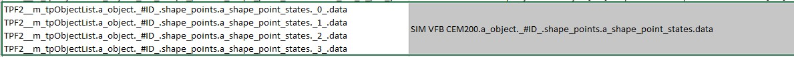
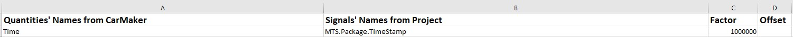

.. erg/mf4 file to bsig file

Tool for transferring the erg/mf4 file to bsig file
======================================================

Introduction
--------------------
This tool takes the erg or mf4 file from CarMaker as input. Basing on a mapping file in Excel format, it generates a bsig file with the pre-defined signals in the mapping file. It can be execute in python command as following: |br|

.. code-block:: bash

	python erg_mdf4_2bsig.py --ergmf4PathFile xxx --mapFile xxx --outputFile xxx -- --samplefrq xx

| The parameter *---ergmf4PathFile* defines the path of input erg/mf4 files and specified erg/mf4 file' name. If only path or folder are given here, the tool can search for all the erg/mf4 in the folder.
| The parameter *---mapFile* defines the path and the name of mapping file in xls or xlsx format.
| The parameter *---outputFile* defines the output path and give the name of the output bsig name in bsig format.
| The parameter *---samplefrq* defines the sample frequency of taking values from erg/mf4 file. If the frequency is higher than the erg/mf4 file, the original frequency of erg/mf4 will be taken.
For example:

.. code-block:: bash

	python erg_mdf4_2bsig.py --ergmf4PathFile d:\VSP_pyBase\pyfctEval\erg_mdf4_2bsig_test\LaneChange_MultiObj_5Lanes_143552.mf4 --mapFile d:\VSP_pyBase\pyfctEval\erg_mdf4_2bsig_test\Signals_Map.xlsx --outputFile d:\VSP_pyBase\pyfctEval\erg_mdf4_2bsig_test\laneChange_mf4.bsig --samplefrq 20

or

.. code-block:: bash

	python erg_mdf4_2bsig.py --ergmf4PathFile d:\VSP_pyBase\pyfctEval\erg_mdf4_2bsig_test\ --mapFile d:\VSP_pyBase\pyfctEval\erg_mdf4_2bsig_test\Signals_Map.xlsx --outputFile d:\VSP_pyBase\pyfctEval\erg_mdf4_2bsig_test\laneChange_mf4.bsig --samplefrq 1000

.. automodule:: pyfctEval.erg_mdf4_2bsig
   :members:
   :private-members:
   
Features of the Tool
-------------------------
Merge erg/mf4 file into one bsig file
^^^^^^^^^^^^^^^^^^^^^^^^^^^^^^^^^^^^^^^^^^
Give the folder address which contains all the erg/mf4 files to be merged to the parameter *---ergmf4PathFile*. The tool will search all the erg/mf4 file in this folder and merge them into one bsig file as pre-defined in the parameter *---outputFile*.

.. note::
	If erg/mf4 files have the same signals which need to be export to bsig, values of those signals only from **last** erg/mf4 file will be export to bsig file.
	
Automatic Replacement of #ID to Numbers
^^^^^^^^^^^^^^^^^^^^^^^^^^^^^^^^^^^^^^^^^^
The tool can search for #ID in the signals names which defined in the Excel mapping file. It will automatically replace the #ID as 0, 1, 2, 3 ... until this signal's ID cannot be found in the erg/mf4 file any more. After that, the tool exports all the replaced signals into bsig file. Please define the signals with #ID like following picture in the Excel table.

.. note::
	The tool can support maximum 3 #ID replacement in one signal at moment.
	
More Signals in erg/mf4 File merging to one matrix Signal in bsig File
^^^^^^^^^^^^^^^^^^^^^^^^^^^^^^^^^^^^^^^^^^^^^^^^^^^^^^^^^^^^^^^^^^^^^^^^^^^^
It is also possible to merge the values from different signals in the erg/mf4 file into one matrix signal in the bsig file. This feature can be defined in the Excel table as following picture. Then a matix signal will be export to the bsig file.

	
Factor and Offset Calculation
^^^^^^^^^^^^^^^^^^^^^^^^^^^^^^^^^^^^^^^^
Factor and offset can be defined in the Excel mapping file. Fill the factor in the column C and offset in the column D only to the related signals like the following picture. Those factor will be multiplied by the values from erg/mf4 and export the results to the bsig file. Those offset will be added to the values from the erg/mf4 file and export the result to the bsig file.

	
	